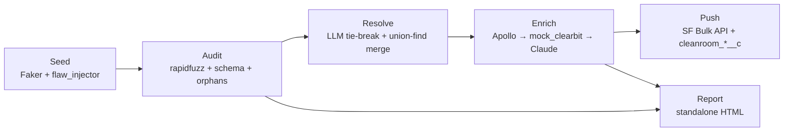

# Cleanroom

**▶ Live demo: [cleanroom-two.vercel.app](https://cleanroom-two.vercel.app)** — the before/after report a recruiter can click into without cloning the repo. Generated by `python scripts/run_demo.py` on the committed 1,000-account messy seed.

> Every CRM I touched as a rep was 40% garbage. Acme Corp, ACME Corp, and Acme Corporation were three separate accounts. Industry was blank on a third of them. Half the contacts had bounced. My AE asked me to "verify the data before you log a touch," which meant 20 minutes of LinkedIn-tab whack-a-mole per record. Reps stop trusting the CRM, stop logging activity, and leadership stops trusting the dashboards.
>
> Cleanroom is a one-command audit + repair pipeline. Point it at a CSV dump (or a Salesforce dev org), and it deduplicates with fuzzy matching + an LLM tie-breaker for the gray zone, runs a schema and completeness audit, enriches missing fields via a Clay-style waterfall (Apollo → mocks → Claude), and pushes a clean dataset back — with a before/after HTML report a CRO can actually read.

**Loom demo:** _coming once the build runs end-to-end — embed lands here_.

---

## What it does

- **Dedups** ~12% of accounts that exist as case/whitespace/legal-suffix/typo/domain variants. (`Acme Corp` + `ACME CORP` + `Acme, Inc.` + `Acmee Corp` collapse to one canonical.)
- **Validates schema** — email format, phone E.164, US state codes, founded-year sanity.
- **Fills missing fields** — industry, revenue, employees, country, phone — via a three-tier enrichment waterfall with **per-field source + confidence + timestamp** recorded.
- **Resolves the gray zone** — `rapidfuzz` decides 95% of dedup pairs deterministically; the 70–89 ambiguous band goes to **Claude Haiku 4.5** with structured JSON output (capped at 500 calls/run).
- **Pushes back to Salesforce** — `simple-salesforce` Bulk API upsert with four `cleanroom_*__c` custom fields (`audit_date`, `confidence_score`, `dedup_canonical_id`, `enrichment_sources`).
- **Renders a CRO-readable HTML report** — standalone, no JS, no external requests at render time. Auto-opens at the end of the demo.

## What this is not

- **Not a Salesforce or HubSpot managed package.** It's a Python pipeline you run from a terminal or a slash command.
- **Not a real-time deduper.** Batch audit + repair, run on demand or scheduled.
- **Not a Clay competitor.** Clay is way more configurable. Cleanroom is opinionated and runnable from one command.
- **Not magic.** The LLM tie-breaker fires on _ambiguous_ pairs only (rapidfuzz 70–89), not on every record. Most matches are decided by deterministic rules.
- **Not internationally validated.** US-only address/state/phone normalization for the demo. International would be a follow-on.

---

## Quickstart

```bash
git clone https://github.com/ryanmichaels-jpg/cleanroom
cd cleanroom
./scripts/setup.sh                  # venv + editable install + macOS .pth workaround
source .venv/bin/activate
python scripts/run_demo.py --size 1000
```

Runs the full five-stage pipeline on 1,000 synthetic accounts in **under 5 seconds** and auto-opens the before/after HTML report.

**Live mode** (real Apollo + real Claude — needs API keys in `.env`):
```bash
python scripts/run_demo.py --size 1000 --live
```

**Push to a Salesforce dev org** (needs SF dev-org creds + one-time field setup — see [`docs/demo.md`](docs/demo.md)):
```bash
python scripts/setup_sf_schema.py    # creates the 4 cleanroom_*__c custom fields
python scripts/run_demo.py --size 1000 --live --commit
```

**Slash command** (inside Claude Code):
```
/cleanroom data/seed/accounts.csv data/seed/contacts.csv
```

---

## Architecture

Five stages, each a Python module under `src/cleanroom/`:



Full module-by-module breakdown + tradeoffs in [`docs/architecture.md`](docs/architecture.md). Demo storyline + live-mode setup in [`docs/demo.md`](docs/demo.md).

---

## Numbers from a fresh run

On the committed 1000-account messy seed (`data/seed/`):

| stage          | runtime | what changed                                                       |
|----------------|---------|--------------------------------------------------------------------|
| audit (before) | 2.0s    | 4,541 issues found · 765 high · 2,803 medium · 973 low             |
| resolve        | 0.7s    | 1,227 → 949 accounts (151 merge groups · 278 records merged away) |
| enrich         | 0.4s    | 613 fields filled across 4 field types                             |
| audit (after)  | 1.0s    | 2,773 issues remaining · 279 high (mostly residual contact dupes)  |
| push (dry-run) | 0.1s    | 949 canonical accounts planned for SF upsert                       |
| report         | 0.1s    | `reports/before_after.html` auto-opens                             |
| **total**      | **~3s** | on 1,227 accounts × 2,776 contacts                                 |

---

## Repo layout

```
cleanroom/
├── README.md / CLAUDE.md                  # this file + Claude Code context
├── .claude/commands/cleanroom.md           # /cleanroom slash command
├── pyproject.toml                          # uv-friendly editable install
├── docs/
│   ├── architecture.md                     # mermaid + module-by-module
│   └── demo.md                             # 2-min Loom flow + SF setup
├── src/cleanroom/
│   ├── cli.py + __main__.py                # `python -m cleanroom <subcommand>`
│   ├── seed/                               # Faker + deterministic flaw injector
│   ├── audit/                              # 5 detectors + Issue dataclass
│   ├── resolution/                         # LLM tie-break + union-find merge
│   ├── enrichment/
│   │   ├── waterfall.py + confidence_tracker.py
│   │   └── providers/                      # apollo + mock_clearbit + claude_websearch
│   ├── push/                               # simple-salesforce Bulk client
│   └── report/                             # jinja2 + before_after.html template
├── scripts/
│   ├── setup.sh                            # venv + chflags workaround + smoke
│   ├── generate_seed.py                    # standalone seed regen
│   ├── setup_sf_schema.py                  # one-shot SF Metadata API field create
│   └── run_demo.py                         # end-to-end runner
├── data/
│   └── seed/                               # 1000-account synthetic CSVs (committed)
└── tests/                                  # 33 tests across 5 modules
```

---

## Credits

**Architectural patterns** borrowed (not installed) from [gooseworks-ai/goose-skills](https://github.com/gooseworks-ai/goose-skills):
- [`contact-cache`](https://github.com/gooseworks-ai/goose-skills/tree/main/skills/capabilities/contact-cache) — dedup keying on the strongest stable signal (LinkedIn URL preferred / email fallback). Cleanroom keys on `domain_root` preferred / normalized name fallback.
- [`apollo-lead-finder`](https://github.com/gooseworks-ai/goose-skills/tree/main/skills/capabilities/apollo-lead-finder) — two-phase match → enrich; cache the manifest between phases.
- [`inbound-lead-enrichment`](https://github.com/gooseworks-ai/goose-skills/tree/main/skills/composites/inbound-lead-enrichment) — provider fallback chain + per-field `high|medium|low` confidence + `sources_used` array.

**Waterfall philosophy** lifted from [Clay's](https://clay.com) public docs — multi-provider chains beat any single source. Clay isn't a runtime dependency here; Cleanroom's free-tier-Apollo + LLM-fallback substitute is the same lesson Project 1 (Reply Guy) makes in this portfolio.

**Sibling-repo conventions** (the macOS `chflags` workaround, `DRY_RUN=1` demo-safe default, slash-command-first design) from earlier projects in this portfolio: [reply-guy](https://github.com/ryanmichaels-jpg/reply-guy), [signal-catcher](https://github.com/ryanmichaels-jpg/signal-catcher).
