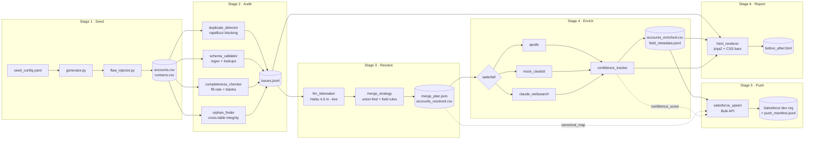

# Cleanroom — Architecture

## Data flow

## Module breakdown

| Module                          | Purpose                                                                   |
|---------------------------------|---------------------------------------------------------------------------|
| `seed.generator`                | Faker-based clean account + contact factory. Deterministic from seed.    |
| `seed.flaw_injector`            | Deterministic mutations: dupes, blanks, schema violations, orphans.       |
| `audit.duplicate_detector`      | rapidfuzz `token_sort_ratio` with 2-axis blocking (name letter + domain). |
| `audit.schema_validator`        | E.164 phones, RFC-ish emails, US state codes, sane founded-year.         |
| `audit.completeness_checker`    | Per-field fill rates + per-record blanks + inactive-owner check.         |
| `audit.orphan_finder`           | Accounts without contacts; contacts with bad/null `account_id`.          |
| `resolution.llm_tiebreaker`     | Haiku 4.5 in `--live`; deterministic heuristic in dry-run. JSON output.   |
| `resolution.merge_strategy`     | Union-find across confirmed pairs; per-field merge (longest text wins).   |
| `enrichment.providers.apollo`   | Real `/v1/organizations/enrich` in `--live`; canned hero data in dry-run. |
| `enrichment.providers.mock_clearbit` | Hash-deterministic synthetic, ~80% coverage, medium confidence.       |
| `enrichment.providers.claude_websearch` | Sonnet 4.6 in `--live`; deterministic stub in dry-run, ~70% coverage. |
| `enrichment.waterfall`          | Walks providers in order; first non-blank wins per (record, field).      |
| `enrichment.confidence_tracker` | Per-field sidecar: `{value, source, confidence, timestamp}`.              |
| `push.salesforce_upsert`        | Bulk API upsert with 4 `cleanroom_*__c` custom fields. Dry-run default.  |
| `report.html_renderer`          | Standalone HTML, no JS, CSS bar charts. Sonnet 4.6 narrative in `--live`. |

## Why these choices

- **rapidfuzz + LLM, not embeddings.** Embeddings need a vector store, tuning, and don't beat normalized-name fuzzy matching on the Acme/Globex pattern. The LLM only sees the gray zone (score 70–89), so it's <500 calls per 1000-account run.
- **Three providers, not one.** Apollo has the best data but narrow coverage (the free tier especially). `mock_clearbit` simulates a mid-tier vendor with broader coverage. `claude_websearch` is the last-resort guess. Same pattern Clay sells as "waterfall."
- **Standalone HTML, not Streamlit.** A report is a thing you screenshot and share, not an app you host. No server, no external requests at render time, opens in any browser.
- **Dry-run default.** A recruiter cloning the repo can run `python scripts/run_demo.py` with zero credentials and see the whole loop work. The `--live` flag is what costs money.

## Tradeoffs the docs admit to

- **US-only address validation.** International state/phone normalization is a follow-on.
- **`claude_websearch` doesn't actually web-search yet.** It uses Sonnet 4.6's prior to guess from a domain. Wiring Anthropic's `web_search` tool is a v2 step.
- **Contact dedup is conservative.** Exact-email + same-account fuzzy-name only. Cross-account contact merges would need a different blocking scheme.
- **Merge strategy isn't fully reversible.** Once merged, the canonical row's `cleanroom_dedup_canonical_id__c` records the chain, but the field-level provenance of which row contributed which value lives only in `decisions_log.jsonl`.
